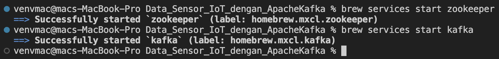
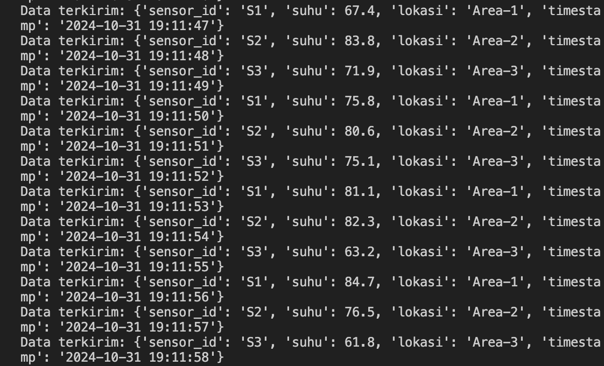
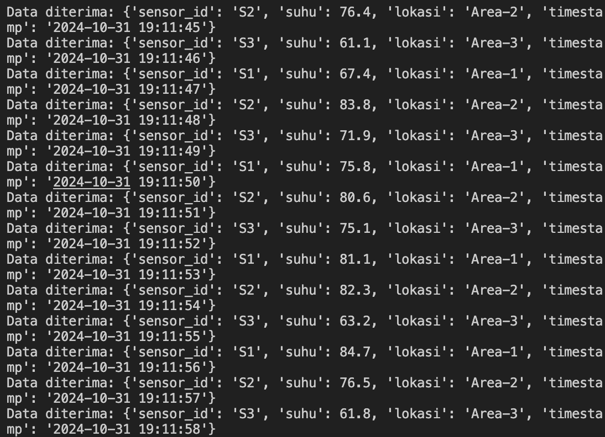
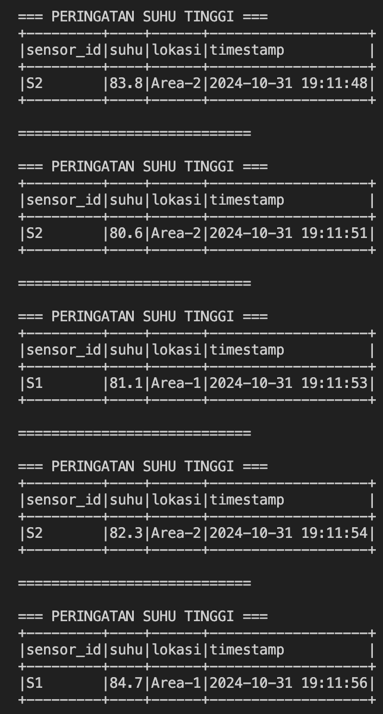

# Studi Kasus Apache Kafka: Pengumpulan Data Sensor IoT dengan Apache Kafka

|         Name            |    NRP     |
|-------------------------|------------|
| Sylvia Febrianti        | 5027221019 |
| Khansa Adia Rahma       | 5027221071 |


## Latar Belakang Masalah
Sebuah pabrik memiliki beberapa mesin yang dilengkapi dengan sensor suhu. Data suhu dari setiap mesin perlu dipantau secara real-time untuk menghindari overheating. Setiap sensor mengirimkan data suhu setiap detik, dan pabrik memerlukan sistem yang dapat mengumpulkan, menyimpan, serta menganalisis data ini.

## Studi Kasus Sederhana
- Pabrik membutuhkan aliran data dari sensor yang dapat diteruskan ke layanan analitik atau dashboard secara langsung.
- Apache Kafka digunakan untuk menerima dan mengalirkan data suhu, sedangkan PySpark mengolah serta memfilter data tersebut.


1. **Buat Topik Kafka untuk Data Suhu:**
   - Membuat topik di Apache Kafka bernama `"sensor-suhu"` untuk menerima data dari sensor mesin.

2. **Simulasi Data Suhu dengan Producer:**
   - Buat producer yang mensimulasikan data suhu dari beberapa sensor mesin (misalnya, 3 sensor berbeda).
   - Setiap data suhu berisi `sensor_id` dan `suhu` saat ini (contoh: `sensor_id: S1, suhu: 70°C`) dan dikirimkan setiap detik ke topik `"sensor-suhu"`.

3. **Konsumsi dan Olah Data dengan PySpark:**
   - Buat consumer di PySpark yang membaca data dari topik `"sensor-suhu"`.
   - Filter data suhu yang melebihi 80°C sebagai indikator suhu tinggi yang memerlukan perhatian.


## Cara Eksekusi

### 1. Memulai Zookeeper dan Kafka Server
- Pastikan Zookeeper dan Kafka sudah terinstal dengan benar.
- **Mulai Zookeeper:**
  ```bash
  brew services start zookeeper
  ```
- **Mulai Kafka Server:**
  ```bash
  brew services start kafka
  ```


### 2. Membuat Topik Kafka
- Buat topik Kafka bernama "sensor-suhu" untuk menerima data dari sensor:
```
kafka-topics --create --bootstrap-server localhost:9092 --replication-factor 1 --partitions 1 --topic sensor-suhu
```

### 3. Jalankan producer dan consumer di terminal terpisah
- *Producer* : Jalankan `producer_dummy.py` untuk mensimulasikan data suhu dari sensor ke topik Kafka "sensor-suhu".
```
python producer_dummy.py
```
- *Consumer Real-Time*: Jalankan `consumer_realtime.py` untuk menampilkan data suhu dari Kafka di console.
```
python consumer_realtime.py
```
- *Consumer Analisis*: Jalankan `consumer_analisis.py` untuk menganalisis data suhu yang lebih dari 80°C.
```
python consumer_analisis.py
```

## OUTPUT
### 1. Producer `producer_dummy.py`
Producer ini mengirim data suhu ke Kafka setiap detik. Output yang muncul di terminal akan terlihat sebagai berikut:


### 2. Real-Time Consumer `consumer_realtime.py`
Consumer ini menampilkan semua data suhu yang diterima dari topik Kafka secara real-time tanpa filter untuk memantau secara langsung:


### 3. Analysis Consumer `consumer_analisis.py`
Consumer ini menampilkan data suhu di atas 80°C sebagai peringatan. Outputnya sebagai berikut:

